<a id="readme-top"></a>

<div align="center">

<a href="https://github.com/bateske/PocketCover">
  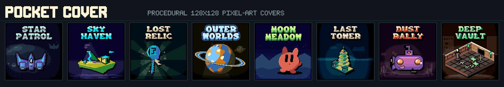
</a>

<h3>Procedural pixel-art covers and avatars, seeded by a title</h3>

<p>
  Type a name, get a 128x128 pixel-art cover: a subject, a lit stage, a palette and native bitmap lettering.<br>
  Made for the CHGame handheld's cart covers, and free for any website that needs covers or avatars.
</p>

[![Release][release-shield]][release-url] [![Stars][stars-shield]][stars-url] [![Forks][forks-shield]][forks-url] [![Issues][issues-shield]][issues-url] [![MIT License][license-shield]][license-url]

[![Platform][platform-shield]][chgame-url] [![Dependencies][deps-shield]](#getting-started) [![Size][size-shield]](#on-device-notes) [![128x128][res-shield]](#the-chgame-cover-contract) [![Deterministic][det-shield]](#api-reference)

<p>
  <a href="https://bateske.github.io/PocketCover/demo/"><strong>Try the demo »</strong></a>
  <br>
  <br>
  <a href="https://bateske.github.io/PocketCover/demo/">Studio</a>
  ·
  <a href="https://bateske.github.io/PocketCover/demo/scroll.html">Scroller</a>
  ·
  <a href="docs/FEATURES.md">Docs</a>
  ·
  <a href="https://github.com/bateske/PocketCover/issues/new?labels=bug">Report a bug</a>
</p>

</div>

<details>
  <summary><strong>Table of contents</strong></summary>
  <ol>
    <li><a href="#about">About</a>
      <ul>
        <li><a href="#features">Features</a></li>
        <li><a href="#style-gallery">Style gallery</a></li>
        <li><a href="#built-with">Built with</a></li>
      </ul>
    </li>
    <li><a href="#getting-started">Getting started</a></li>
    <li><a href="#api-reference">API reference</a></li>
    <li><a href="#the-chgame-cover-contract">The CHGame cover contract</a></li>
    <li><a href="#how-it-works">How it works</a></li>
    <li><a href="#running-the-demo-locally">Running the demo locally</a></li>
    <li><a href="#development">Development</a></li>
    <li><a href="#on-device-notes">On-device notes</a></li>
    <li><a href="#license">License</a></li>
    <li><a href="#acknowledgments">Acknowledgments</a></li>
  </ol>
</details>

## About

Pocket Cover turns a title such as `Star Patrol` into a finished 128x128
pixel-art cover. The title is the seed. The same title, style and variant
always give the same pixels, so a site can store a name and regenerate its
cover whenever it needs it, without keeping an image. Different titles give
different subjects, palettes, scenery and lettering, and each title has an
endless run of variants.

It began as the cover-art generator for carts on the
[CHGame][chgame-url] handheld. Every cover fits that console's cover format:
128x128 pixels, at most 11 custom colours plus CHGame's 4 fixed colours, all
exact in RGB565. The same output works as a game cover, a profile avatar, a
placeholder thumbnail, or anywhere else a small, unique, deterministic image
helps.

There are no image assets. Every subject and background is drawn from
geometry and sampled materials at generation time. The only authored pixel
tables are the title fonts.

### Features

- **12 styles**: mascots, spaceships, strange machines, relics, alien
  botany, floating islands, buildings, vehicles, planets, heraldry, glyphs
  and dungeon dioramas.
- **A 15-colour, CHGame-safe palette per cover**: 11 custom colours built in
  OKLCh from a mood (night, complementary, analogous, dusk, and rare infernal,
  toxic, neon, monochrome, sepia and pastel looks), plus black, cream, grey
  and red. Every colour decodes exactly in RGB565, and the animated rainbow
  key `#FF00FF` is never emitted.
- **A title stack in native bitmap fonts**: four pixel fonts, drawn at their
  own pixel grid and never scaled, with treatments that suit the mood.
- **A lit stage**: outlines and drop shadows from the subject's own mask,
  ground shadows, lamps, beams and depth layers, and varied framing that
  fits each subject to the space under the title.
- **Wildness tiers**: most variants stay canonical, and a seeded deck deals
  rarer, wilder looks among each title's variants.
- **Deterministic**: no clock, no `Math.random()`. The same inputs give the
  same bytes on every platform.
- **Zero dependencies**, plain ES modules, in the browser, Node 18+ and web
  workers. `generateCover` needs no DOM.
- **Small**: about 130 KB of source gzipped for all twelve styles, and
  `createGenerator` lets a host ship only the styles it uses.

### Style gallery

Each image shows variants 0 to 11 of one title, at native size.

| Style id | Subject | Variants 0-11 |
| --- | --- | --- |
| `mascot` | Friendly original characters in a landscape (the default) | 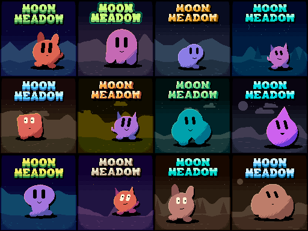 |
| `spaceships` | Interceptors, fighters, freighters and explorers | 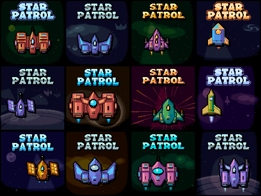 |
| `machines` | Tanks, gauges, pipes, gears, coils and dishes | 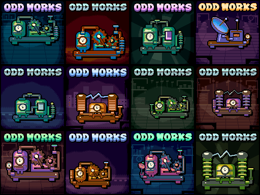 |
| `relics` | Swords, crystals, keys, amulets, grimoires, rings and staffs | 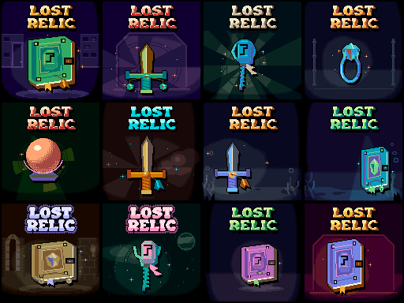 |
| `plants` | Pods, mushrooms, branching stems, flowers and toothed plants | 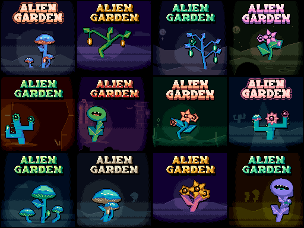 |
| `islands` | Floating dioramas with towers, peaks, trees and waterfalls | 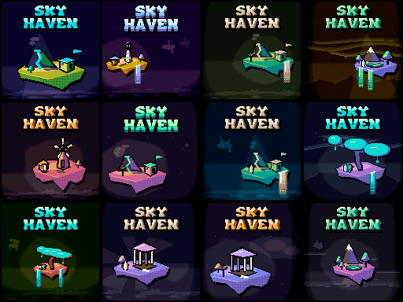 |
| `buildings` | Wizard towers, castles, temples, factories and spires | 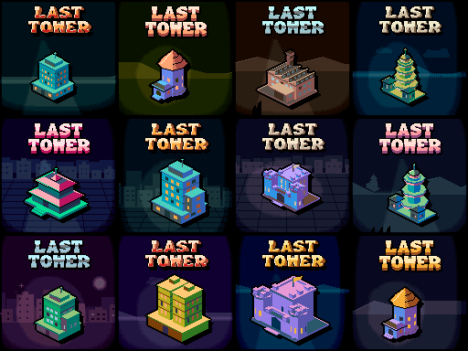 |
| `vehicles` | Cars, tanks, submarines and rovers | 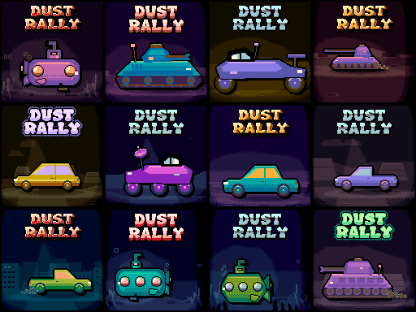 |
| `planets` | Banded, oceanic and fractured worlds, rings and moons | 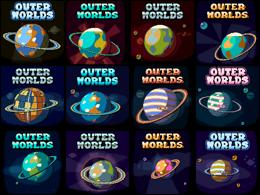 |
| `heraldry` | Shield fields, divisions, charges and ornaments | 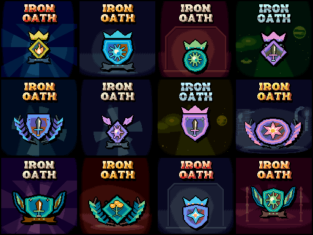 |
| `glyphs` | Connected rune skeletons, terminals and halos | 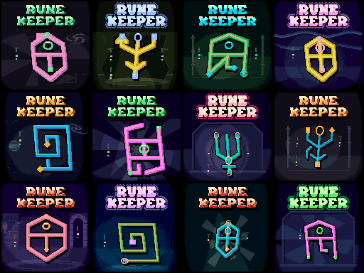 |
| `dungeons` | 2:1 cutaway rooms with doors, pools, bridges and treasure | 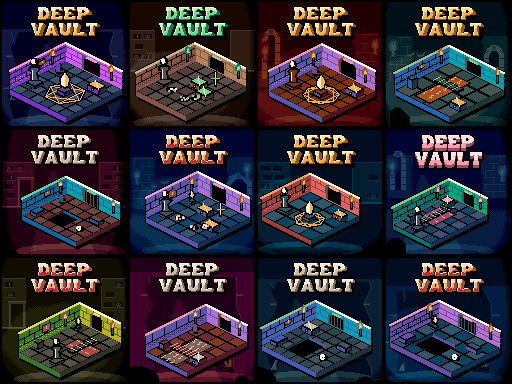 |

<div align="center">
  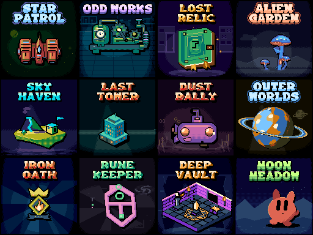
</div>

### Built with

[![JavaScript][js-shield]][js-url] [![Node.js][node-shield]][node-url] [![HTML5 Canvas][canvas-shield]][canvas-url]

Plain ES modules, no build step. Node is used only for the tests, contact
sheets and tools.

<p align="right">(<a href="#readme-top">back to top</a>)</p>

## Getting started

Install from npm, or straight from git:

```sh
npm install pocket-cover
npm install github:bateske/PocketCover
```

Draw a cover on a canvas, in a plain page with no bundler:

```html
<canvas id="cover" width="128" height="128" style="width:256px;image-rendering:pixelated"></canvas>
<script type="module">
  import {drawCover} from './node_modules/pocket-cover/src/index.js';
  drawCover(document.getElementById('cover'), 'Star Patrol', {style: 'spaceships', variant: 3});
</script>
```

Or generate the pixels yourself, in Node, a worker or a browser:

```js
import {generateCover, styles} from 'pocket-cover';

const cover = generateCover('Star Patrol', {style: 'spaceships', variant: 3});
cover.indices;   // Uint8Array(128*128): palette index per pixel
cover.palette;   // Uint32Array(15): 0xRRGGBB colours
cover.pixels;    // Uint32Array(128*128): 0xRRGGBB per pixel (null with rgb:false)
styles.map(s => s.id); // ['mascot', 'spaceships', ...]
```

Ship only the styles you need:

```js
import {createGenerator} from 'pocket-cover/engine';
import spaceships from 'pocket-cover/recipes/spaceships';
import planets from 'pocket-cover/recipes/planets';

const {generateCover, drawCover, styles} = createGenerator([spaceships, planets]);
```

> [!NOTE]
> The output depends on the engine version. Record the package version with
> any seed you share; a saved PNG never changes.

<p align="right">(<a href="#readme-top">back to top</a>)</p>

## API reference

| Export | What it does |
| --- | --- |
| `generateCover(title, options?)` | Returns a cover object (below). No DOM needed. |
| `drawCover(canvas, title, options?)` | Sets the canvas to 128x128, paints the cover, returns the same object. |
| `styles` | Frozen list of `{id, label, revision, features, specializedFeatures}`. |
| `createGenerator(recipes, {defaultStyle}?)` | Builds `{generateCover, drawCover, styles}` from chosen recipes. |
| `VERSION`, `SIZE` | Engine version (`19`) and cover size (`128`). |

Subpaths: `pocket-cover/engine`, `/raster`, `/masks`, `/materials`,
`/geometry`, `/variation` and `/recipes/<id>` for writing or trimming
recipes; see [docs/FEATURES.md](docs/FEATURES.md).

**Arguments.** `title` is 1-31 printable ASCII characters and not blank.
Outer spaces are trimmed and runs of spaces collapse. Case changes the seed;
the printed title is upper case.

| Option | Default | Meaning |
| --- | --- | --- |
| `style` | `'mascot'` | One of the style ids above. Unknown ids throw. |
| `variant` | `0` | Any nonnegative safe integer. |
| `framing` | `'varied'` | `'classic'` keeps a fixed viewport; with `mascot` it reproduces the original v8 covers byte for byte. |
| `diagnostics` | `false` | Adds cleanup candidates, the subject layer, title mask and stage data to `quality`. |
| `rgb` | `true` | `false` skips the `pixels` array when you only need `indices` and `palette`. |

**Result.** `width`, `height`, `pixels`, `indices`, `palette`, the
normalised `title`, `variant`, `style`, `version`, `styleVersion`,
`framing`, `composition`, `traits` (subject description, including its
`archetype`), `titleLines`, `titleBottom`, `titleExtent`, `look` (mood,
tier, wildness, treatment and hues, or `null` for the classic mascot) and
`quality`.

<p align="right">(<a href="#readme-top">back to top</a>)</p>

## The CHGame cover contract

- **128x128 pixels**, one byte per pixel in `indices`.
- **15 palette entries.** The 11 custom colours sit at indices 0-3, 5-7 and
  9-12; the fixed CHGame colours are black (4), cream `#FFF4D6` (8), grey
  (13) and red (14). Every colour is exact in RGB565, and the animated
  rainbow key `#FF00FF` (slot 15) and its near neighbours never appear.
  (The classic `mascot` framing keeps its original v8 palette.)
- **Exporting for a cart**: download the native 128x128 PNG from the studio
  (or encode `cover.pixels` yourself; `scripts/png.mjs` is a minimal
  encoder), then hand it to CHGame's cover tooling, which packs the palette
  and converts to RGB565. Never export a scaled-up image.

<p align="right">(<a href="#readme-top">back to top</a>)</p>

## How it works

1. **Seed**: the style, recipe revision, title and variant are hashed into
   independent random streams for the subject, look, scenery and layout.
2. **Look**: a wildness tier, a mood, a title treatment and the 15-colour
   palette.
3. **Title**: the title is laid out in a bitmap font, which reserves the top
   of the cover.
4. **Subject**: the style's recipe draws geometry once into a recording; the
   engine measures it and replays it at its final scale in the space left.
5. **Effects**: outlines, drop shadows and edge shading are derived from the
   subject's own fill mask, in exact device pixels.
6. **Stage**: background scenery, depth layers, ground shadows, lamps and
   foreground, then a frame pass and the title on top.
7. **Cleanup**: only detached single pixels nobody asked for are removed;
   marked details such as eyes, stars and glints are kept.

[docs/FEATURES.md](docs/FEATURES.md) lists the shared features, their
consumers and memory costs, and what each recipe can trim.
[docs/PIXEL_ART_RULES.md](docs/PIXEL_ART_RULES.md) records the project's
pixel-art rules, with sources and exceptions.

<p align="right">(<a href="#readme-top">back to top</a>)</p>

## Running the demo locally

```sh
npm start
```

Then open <http://127.0.0.1:4173> for the studio (`demo/index.html`): pick a
style and title, browse variants and download native PNGs. The infinite
scroller is at `/demo/scroll.html`.

Online: [studio](https://bateske.github.io/PocketCover/demo/) and [scroller](https://bateske.github.io/PocketCover/demo/scroll.html). No server needed: [demo/standalone.html](https://bateske.github.io/PocketCover/demo/standalone.html) is the whole
studio in one offline file. Double-click it. Rebuild it after source changes
with `npm run standalone`.

<p align="right">(<a href="#readme-top">back to top</a>)</p>

## Development

```sh
npm test              # node --test: the full suite
npm run examples      # contact sheets and manifests into examples/ (git-ignored)
npm run standalone    # rebuild demo/standalone.html (add -- --check to verify it)
npm run review        # pixel review sheets and craft lint
npm run banner        # rebuild docs/banner.png
```

`npm run digest` and `npm run compare` compare the current engine with a
frozen engine-18 copy in `baseline/engine18/`. That copy is local and
git-ignored; without it these scripts say so and stop. More QA tools (bench,
size, diversity, sheets) are described in [tools/qa/README.md](tools/qa/README.md).
Read [AGENTS.md](AGENTS.md) and [docs/PIXEL_ART_RULES.md](docs/PIXEL_ART_RULES.md)
before changing how anything is drawn.

<p align="right">(<a href="#readme-top">back to top</a>)</p>

## On-device notes

The engine is written so that a style could one day run on the CHGame
itself (a CH32X035: 48 MHz RISC-V, no FPU, about 50 KB of usable flash and
18 KB of RAM). Seeds, hashing and variation are integer-exact; effects come
from binary masks; scenes and recipes are separately trimmable.

A fixed-point C port of the shared core plus one recipe is estimated at
about 22–32 KB of flash and 16.5 KB of RAM in a dedicated app (4-bit
framebuffer plus 1-bit masks), drawing a cover in roughly 40–200 ms.
Several styles (about 4–6) could share one app; a small recipe interpreter
reading recipes from the SD card would allow all of them. These are
estimates from the JavaScript, not a measured port.

<p align="right">(<a href="#readme-top">back to top</a>)</p>

## License

The code is released under the [MIT License](LICENSE), copyright 2026
bateske.

> [!WARNING]
> The bitmap fonts in `src/font.js` are not covered by the MIT License. Two of
> the four (fonts 0 and 1, TomAndJerry14x10 and MonoBold8x8) have
> **unclear redistribution terms**. Round9x13 is under the SIL OFL 1.1 and
> MinimalFont5x7's author allows free use. Read [NOTICE.txt](NOTICE.txt)
> before redistributing.

<p align="right">(<a href="#readme-top">back to top</a>)</p>

## Acknowledgments

- Fonts: Kate Garcia (MinimalFont5x7), StePickford (TomAndJerry14x10),
  castpixel (MonoBold8x8) and heraldod
  ([Round9x13](https://heraldod.itch.io/bitmap-fonts)).
- Pixel-art references cited in [docs/PIXEL_ART_RULES.md](docs/PIXEL_ART_RULES.md):
  [Saint11](https://saint11.art/pixel_art_articles/)'s pixel-art articles,
  Cure's [Pixel Art Tutorial](https://pixeljoint.com/forum/forum_posts.asp?TID=11299),
  [SLYNYRD](https://www.slynyrd.com/blog/2022/11/28/pixelblog-41-isometric-pixel-art)'s
  Pixelblog, Surma's [Ditherpunk](https://surma.dev/things/ditherpunk/),
  Müller et al.'s [Procedural Modeling of Buildings](https://doi.org/10.1145/1179352.1141931)
  and Michael Azzi's [Pixel Logic](https://pixellogicbook.com/).
- Colour maths: Björn Ottosson's OKLab.
- [CHGame][chgame-url], the handheld these covers were made for.

<p align="right">(<a href="#readme-top">back to top</a>)</p>

[release-shield]: https://img.shields.io/github/v/release/bateske/PocketCover?style=for-the-badge&color=d0ad62
[release-url]: https://github.com/bateske/PocketCover/releases/latest
[stars-shield]: https://img.shields.io/github/stars/bateske/PocketCover?style=for-the-badge&color=5c7fa0
[stars-url]: https://github.com/bateske/PocketCover/stargazers
[forks-shield]: https://img.shields.io/github/forks/bateske/PocketCover?style=for-the-badge&color=5c7fa0
[forks-url]: https://github.com/bateske/PocketCover/network/members
[issues-shield]: https://img.shields.io/github/issues/bateske/PocketCover?style=for-the-badge&color=5c7fa0
[issues-url]: https://github.com/bateske/PocketCover/issues
[license-shield]: https://img.shields.io/badge/license-MIT-4a6a7a?style=for-the-badge
[license-url]: https://github.com/bateske/PocketCover/blob/main/LICENSE
[platform-shield]: https://img.shields.io/badge/made%20for-CHGame-2e3f6e?style=for-the-badge
[deps-shield]: https://img.shields.io/badge/dependencies-0-2e3f6e?style=for-the-badge
[size-shield]: https://img.shields.io/badge/size-~130%20KB%20gzip-2e3f6e?style=for-the-badge
[res-shield]: https://img.shields.io/badge/covers-128x128-6e4a8a?style=for-the-badge
[det-shield]: https://img.shields.io/badge/output-deterministic-6e4a8a?style=for-the-badge
[chgame-url]: https://github.com/bateske/CHGame
[js-shield]: https://img.shields.io/badge/JavaScript-F7DF1E?style=for-the-badge&logo=javascript&logoColor=black
[js-url]: https://developer.mozilla.org/docs/Web/JavaScript
[node-shield]: https://img.shields.io/badge/Node.js-5FA04E?style=for-the-badge&logo=nodedotjs&logoColor=white
[node-url]: https://nodejs.org/
[canvas-shield]: https://img.shields.io/badge/HTML5%20Canvas-E34F26?style=for-the-badge&logo=html5&logoColor=white
[canvas-url]: https://developer.mozilla.org/docs/Web/API/Canvas_API
